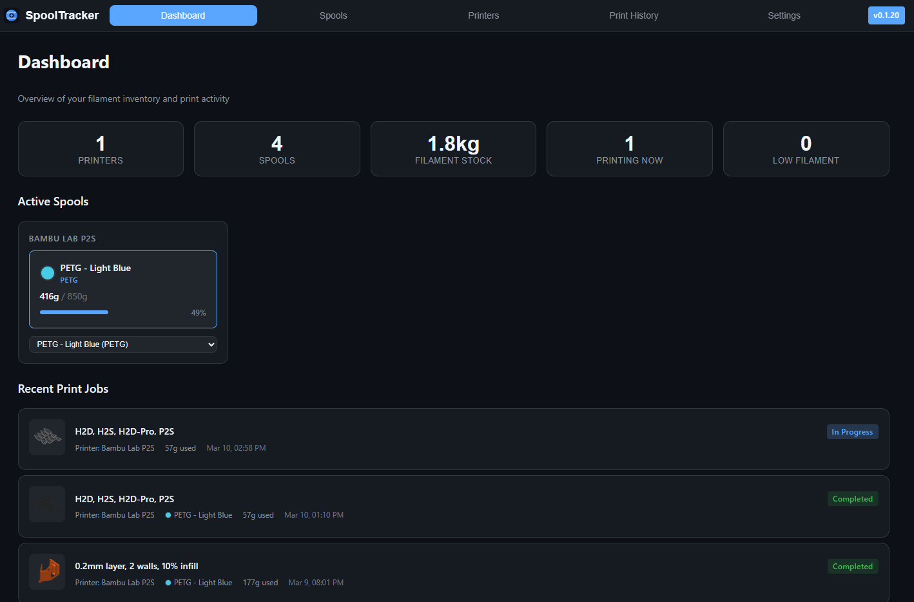
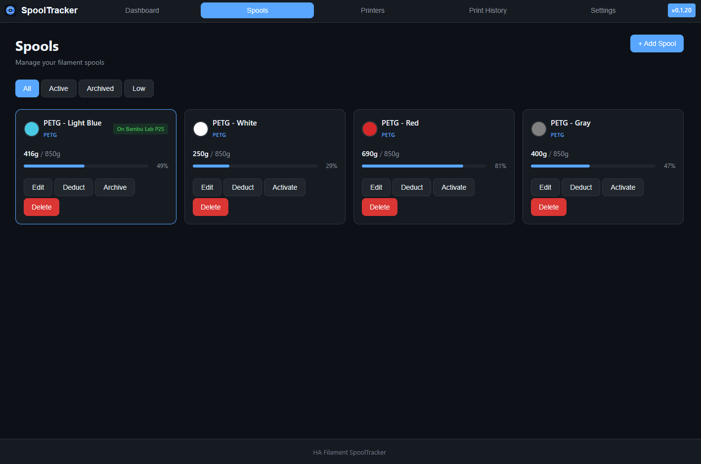
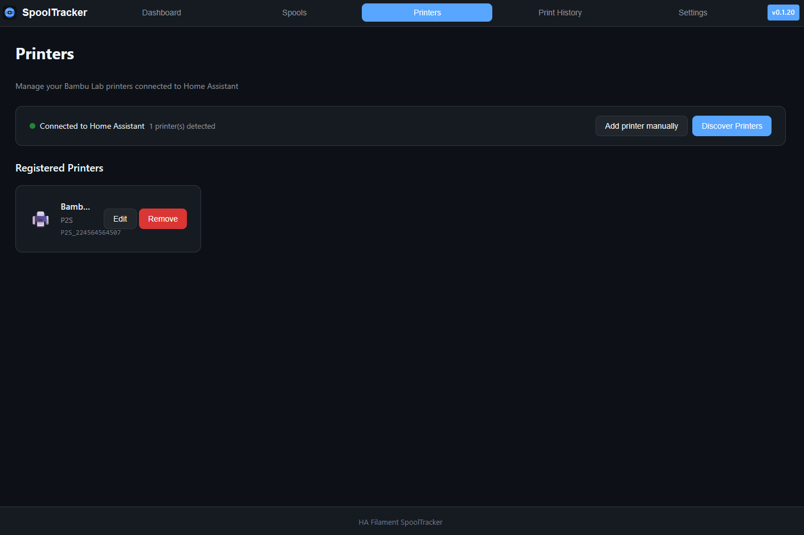
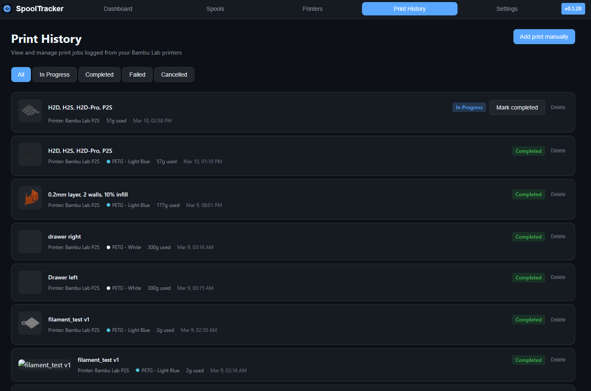
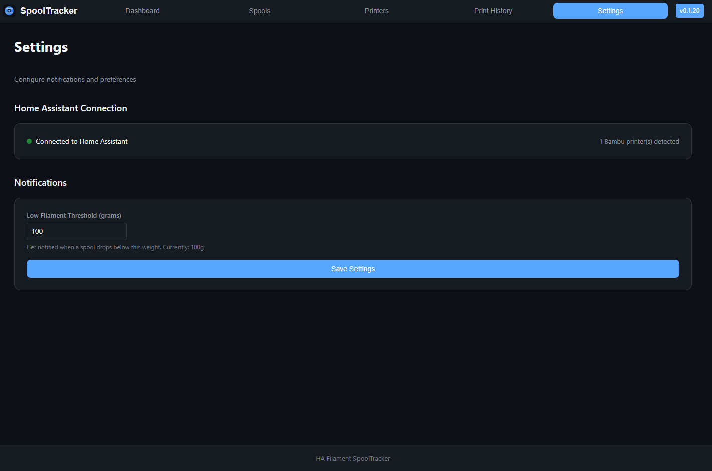

# HA Filament SpoolTracker

A Home Assistant add-on for tracking 3D printer filament spool usage with automatic Bambu Lab integration.

Home Assistant community thread:  
[HA Filament SpoolTracker – Filament & Print Job Tracker for Bambu Lab](https://community.home-assistant.io/t/add-on-ha-filament-spooltracker-filament-print-job-tracker-for-bambu-lab-octoprint-planned/994230)

## Features

- **Spool Management** -- Add, edit, archive, and delete filament spools with color, type, weight tracking, and remaining filament progress bars
- **Automatic Print Logging** -- Detects print jobs from Bambu Lab printers via the HA integration and auto-logs them with project name, thumbnail, and filament used
- **Filament Deduction** -- Automatically deducts filament from the assigned spool when a print completes; supports manual deductions for failed prints or calibration
- **Multi-Printer Support** -- Tracks multiple Bambu Lab printers, auto-discovered from Home Assistant
- **Dashboard** -- Overview of filament stock, active prints, low filament warnings, and recent print history
- **Notifications** -- HA persistent notifications for low filament levels, unassigned print jobs, and expiring spools

### UI Preview

Dashboard:



Spools:



Printers:



Print History:



Settings:



## Prerequisites

- Home Assistant with the [Bambu Lab integration](https://github.com/greghesp/ha-bambulab) installed and configured
- At least one Bambu Lab printer connected to Home Assistant

## Installation

1. Add this repository to your Home Assistant add-on store
2. Install the **HA Filament SpoolTracker** add-on
3. Start the add-on -- it will appear in the sidebar as **SpoolTracker**

## Getting Started

### 1. Connect Your Printers

Open the **Settings** tab. The add-on automatically discovers Bambu Lab printers from your Home Assistant instance. Confirm the discovered printers or adjust entity IDs if needed.

### 2. Add Your Spools

Go to the **Spools** tab and click **Add Spool**. Enter the filament type, pick a color, and set the initial weight. The spool name is optional -- it auto-generates from the type and color if left blank.

### 3. Start Printing

When a print starts on a connected printer, the add-on automatically creates a print job record. Once the print completes, the filament used is deducted from the assigned spool. If the spool can't be auto-matched, you'll get a notification to assign it manually from the **Print History** tab.

## How It Works

### Automatic Print Detection

The add-on subscribes to state changes from the Bambu Lab HA integration. When a print starts:

1. A print job record is created with the project name, thumbnail, and estimated filament usage
2. The spool is matched by the active AMS tray or user-assigned mapping
3. When the print completes, the filament used is deducted from the spool's remaining weight
4. If no spool can be matched, a notification prompts you to manually assign one

### Notifications

The add-on sends Home Assistant persistent notifications for:

- **Low filament** -- when a spool drops below the configured threshold (default: 100g)
- **Unassigned print jobs** -- completed prints that couldn't be auto-matched to a spool
- **Expiring spools** -- filament approaching its expiration date

Notification thresholds can be adjusted in the **Settings** tab.

### Spool Lifecycle

| State | Meaning |
|-------|---------|
| **Active** | Currently loaded in a printer |
| **Inactive** | In stock but not loaded |
| **Archived** | Empty or retired, hidden from the main view |

You can manually archive, reactivate, or deduct filament from any spool via the spool card menu.

## Running outside Hass.io (standalone Docker)

You can run the add-on in Docker on another machine and still connect it to your Home Assistant instance.

### 1. Create a Long-Lived Access Token in Home Assistant

In HA: **Profile → Security → Long-Lived Access Tokens** → Create token. Copy the token.

### 2. Build the image

```bash
pnpm addon:build
```

### 3. Run the container

Copy `.env.example` to `.env`, set `HOME_ASSISTANT_URL` and `SUPERVISOR_TOKEN`, then run:

```bash
pnpm addon:standalone
```

To stop: `pnpm addon:standalone:down`


Then open **http://localhost:3000** for the SpoolTracker UI. The add-on will use your token to talk to the WebSocket and REST APIs on the given HA URL.

Optional env vars:

| Variable | Default | Description |
|----------|---------|-------------|
| `HOME_ASSISTANT_URL` | (none) | HA base URL, e.g. `http://192.168.1.100:8123`. Required for HA integration. |
| `SUPERVISOR_TOKEN` | (none) | Long-Lived Access Token from HA. Required for HA integration. |
| `PORT` | `3000` | Port the app listens on. |
| `DATABASE_URL` | `file:/data/app.db` | SQLite path or PostgreSQL URL. |
| `LOG_LEVEL` | `info` | `debug`, `info`, `warning`, or `error`. |
| `SUPERVISOR_TOKEN_FILE` | (none) | Path to a file containing the token (e.g. mounted secret). Used when `SUPERVISOR_TOKEN` is not set. |

If the add-on and HA use different networks (e.g. Docker bridge vs host), ensure the host/port in `HOME_ASSISTANT_URL` is reachable from the container (e.g. use the host’s LAN IP, not `localhost`).

## Development

<details>
<summary>Developer setup instructions</summary>

### Prerequisites

- Node.js 18+
- pnpm 8+

### Setup

```bash
pnpm install
cp server/config.example.env server/.env
pnpm prisma:generate
pnpm --filter @ha-addon/server db:push
pnpm dev
```

The client runs on `http://localhost:5173` and proxies API calls to the server on port `3001`.

### Build

```bash
pnpm addon:build
```

</details>

## License

MIT
